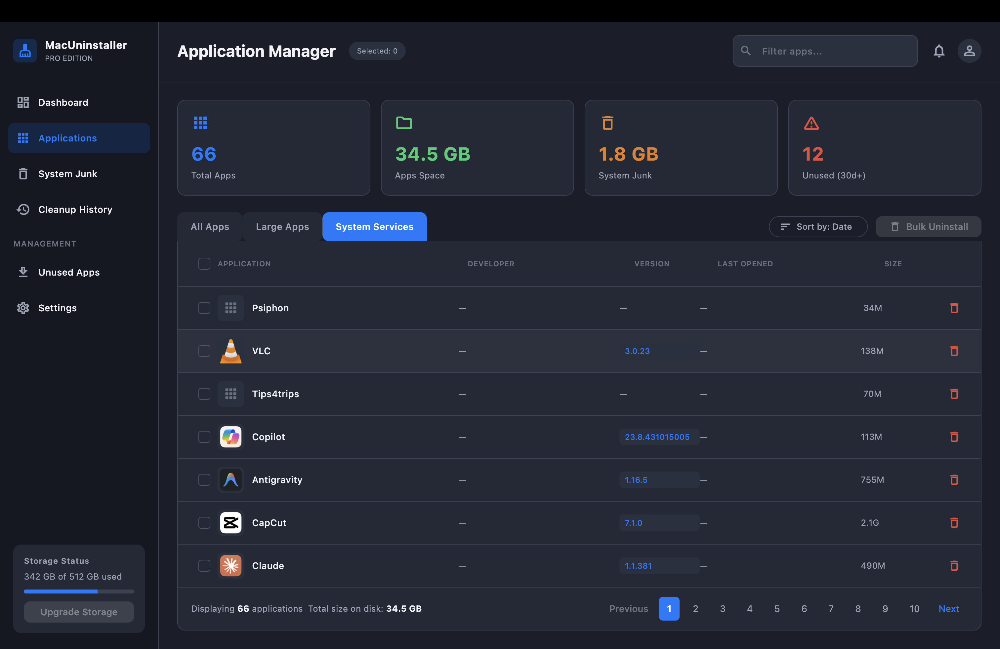

# MacUninstaller

A macOS app that removes applications **and the files they leave behind** — the
support folders, caches, preferences, logs and launch agents a drag-to-Trash
uninstall silently keeps.



## Two ways to use it

**The main window** — a dashboard over every app in `/Applications`,
`~/Applications` and `/System/Applications`, with real sizes, vendor, version
and last-used date, filters (All / Large / Unused), sorting, search, and single
or bulk uninstall.

**The menu bar panel** — click the drive icon in the menu bar for a popover
showing disk usage, your biggest apps, and reclaimable cache/log junk. Apps can
be removed straight from there without opening the window.

Both are the same app: the window keeps its dock icon, and closing it leaves the
menu bar item running.

## How uninstalling works

1. **Preview first.** Selecting an app scans for its leftovers by bundle id
   (`com.acme.Widget`, `com.acme.Widget.plist`, `com.acme.Widget.helper.plist`)
   and by exact display-name match, across `~/Library` and `/Library`.
2. **You choose.** Every item is listed with its size and a checkbox, with a
   running total of the space it frees. Items needing admin rights are flagged.
3. **Move to Trash by default.** Removal goes through `FileManager.trashItem`,
   so everything is recoverable. A switch in the dialog offers permanent
   deletion instead.
4. **Guarded.** The native layer refuses protected locations (`/System`,
   `/Applications` itself, `~/Library` and its standard subfolders, the home
   directory) regardless of what asks. Apps under `/System/Applications` are
   listed but never removable — macOS protects them.

Failures are reported per item rather than swallowed, so a leftover that needs
administrator rights tells you so instead of appearing to succeed.

## Requirements

- macOS 11 or later
- Flutter 3.35+ (developed on 3.38.10)
- **The app is not sandboxed**, and cannot be: it reads `/Applications` and
  `~/Library` and shells out to `plutil`, `du` and `mdls`. This rules out Mac
  App Store distribution, which is why it ships as a DMG.
- **Full Disk Access** is optional but recommended. Without it, a few
  TCC-protected folders are skipped silently and the leftover scan will
  under-report. There is a shortcut to the setting in the sidebar.

## Running from source

```bash
flutter pub get
flutter run -d macos
```

## Building an unsigned DMG

```bash
./scripts/build_dmg.sh          # release build, then package
./scripts/build_dmg.sh --open   # ... and reveal it in Finder
```

Produces `dist/MacUninstaller-<version>.dmg` containing the app and an
`/Applications` shortcut. The app is ad-hoc signed (`codesign --sign -`), not
Developer ID signed and not notarized, so macOS quarantines it after download.
On the target Mac, either right-click the app and choose **Open**, or:

```bash
xattr -dr com.apple.quarantine /Applications/MacUninstaller.app
```

## Project structure

```
lib/
  core/
    platform/system_bridge.dart     Method channel: trash, delete, disk, icons
    theme/                          Dark theme tokens and text styles
    utils/disk_utils.dart           du -sk sizing + bounded-concurrency pool
    widgets/                        Reusable presentational widgets
  features/apps/
    data/models/                    MacApp, LeftoverItem
    data/services/                  Scanner, leftover scanner, junk scanner, cache
    logic/                          AppsBloc: scan, refresh, uninstall, clean
    presentation/                   Main window, table, preview dialogs
  features/menubar/
    platform/popover_bridge.dart    Method channel: popover size, open, quit
    presentation/                   The popover panel and its widgets
macos/Runner/
  SystemChannel.swift               FileManager-based removal, disk, icons
  MenuBarController.swift           NSStatusItem + NSPopover + 2nd Flutter engine
scripts/build_dmg.sh                Release build → ad-hoc sign → DMG
```

The scan runs in stages so the window is usable immediately: cached results
paint first, then fresh metadata (parallel `plutil` + `du -sk`, one batched
`mdls` for last-used dates), then icons, then the slower junk sweep. Results are
cached in `~/Library/Application Support/MacUninstaller/`, which is also how the
menu bar panel — a second Flutter engine, and therefore a separate Dart isolate —
stays in sync with the main window.

## Status

Implemented from [docs/app.md](docs/app.md): app scanner, deep cleanup engine,
safe preview mode, move-to-Trash vs permanent delete, bundle-id-driven
detection, unused-app detection, storage analysis for caches/logs/saved state
and orphaned leftovers.

Not implemented: startup manager, duplicate file finder, scheduled cleanup,
scan history.

## License

Private / unpublished.
