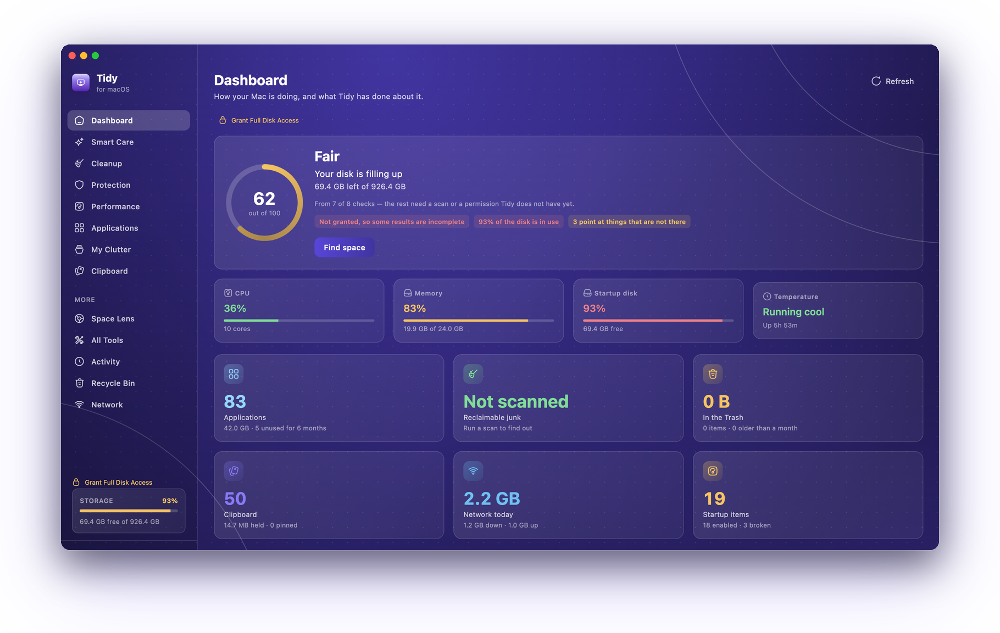

<div align="center">


<h1 align="center">Tidy</h1>

<p align="center"><strong>A Mac utility toolkit. One app for the small jobs macOS makes awkward.</strong></p>

<p align="center">
  Clipboard history &nbsp;·&nbsp; disk cleanup &nbsp;·&nbsp; uninstalling apps properly
  <br />
  startup and process control &nbsp;·&nbsp; getting things back out of the Trash
  <br />
  live network traffic &nbsp;·&nbsp; what your AI coding tools have got through
</p>

<p align="center"><a href="https://tidy.yunweneric.com"></a>&nbsp;&nbsp;<a href="https://github.com/yunweneric/tidy/releases/latest"></a></p>

<p align="center">&nbsp;&nbsp;&nbsp;&nbsp;<a href="https://github.com/yunweneric/tidy/releases/latest"></a>&nbsp;<a href="LICENSE"></a></p>

<br />

<p align="center"></p>

</div>

<br />

It started as an uninstaller. That is still in here, but it is one module of
several now.

**[tidy.yunweneric.com](https://tidy.yunweneric.com)** — the landing page, with
the app itself running in it on invented data. It is this repository compiled
for the web from `lib/main_landing.dart`; see [The landing page](#the-landing-page).

---

## Contents

**Using it** · [What's in it](#whats-in-it) · [The menu bar](#the-menu-bar) ·
[Highlights](#highlights) · [Updating](#updating)

**Building it** · [Requirements](#requirements) ·
[Running from source](#running-from-source) · [Flavors](#flavors) ·
[Building and releasing](#building-and-releasing) ·
[The landing page](#the-landing-page)

**Reading it** · [Project structure](#project-structure) ·
[Architecture](#architecture) · [A note on names](#a-note-on-names) ·
[License](#license)

---

## What's in it

| Module | What it does | State |
|---|---|---|
| **Dashboard** | A health score, live vitals, storage, and what Tidy has done | ✅ Built |
| **Smart Care** | One pass over every built check — caches, logs, saved window state, Xcode and package-manager caches, leftovers, unused apps — reviewed in one place | ✅ Built |
| **Clipboard** | Searchable copy history with pins, images and a `⌘⇧V` hotkey | ✅ Built |
| **Performance** | Login items, background agents, macOS maintenance, running processes | ✅ Built |
| **Applications** | Uninstall apps and everything they left behind | ✅ Built |
| **Recycle Bin** | Every trash on every volume, with working Put Back | ✅ Built |
| **Network** | Live throughput per interface, and the history behind it | ✅ Built |
| **AI Usage** | What Claude Code and Codex got through, at published API rates | ✅ Built |
| **Space Lens** | A map of what is filling the disk, a folder at a time | ✅ Built |
| **Protection** | Signatures and provenance for startup items, extensions and apps | ✅ Built |
| **My Clutter** | Duplicates, similar photos, large and old files | ⏳ Planned |

Planned modules are visible in the sidebar and say plainly that they are not
built yet. None of them show a scan button that finds nothing — a cleaner
reporting "0 threats found" from a scanner that does not exist is lying, and
this app does not do that.

## The menu bar

Four surfaces live up there — **Overview**, **AI**, **Clipboard** and
**Network** — in one of two layouts. *One item* is the default: a single Tidy
icon whose popover has a tab per surface. *Separate items* gives each surface
its own icon and its own switch.

The choice is about width, and it is real rather than cosmetic. A menu bar has
only what is left after the frontmost app's menus, and on a notched Mac only
what is left to the right of the notch. Past that macOS does not shrink
anything — it hands out slots underneath the notch, where nothing is drawn, and
icons you already had disappear.

**Overview** is live vitals — CPU, memory, swap, thermal state, uptime — plus
reclaimable junk, Trash size, your recent clips, and what is currently using the
most CPU. Most of it is actionable without opening the window.

**Network and AI Usage draw figures rather than a glyph**, which is what costs
the room: current down and up rates (two lines, a small live graph, or one
compact line), and today's AI spend (cost, cost and tokens, or cost with a bar
showing how far into the current five-hour block you are).

The popover runs a **second Flutter engine**, so all of it works with the main
window closed. Closing the window leaves it running.

## Highlights

**Clipboard history lives natively.** The store is Swift, not Dart, for two
reasons: capture has to keep working with no window open, and with two Flutter
engines in separate isolates a Dart-side store would be two writers racing on
every copy. Each engine gets a channel onto the one native store.

The global hotkey uses Carbon's `RegisterEventHotKey` rather than an `NSEvent`
global monitor. The monitor route needs Accessibility permission and sees every
keystroke you type — a large thing to ask for one shortcut. This route asks for
nothing and only hears the combination it registered.

**The network meter counts bytes, it does not look at them.** It reads the
interfaces' cumulative counters once a second — the cadence Activity Monitor
uses — and takes deltas. Three things there are easy to get wrong, and all three
are handled where they happen: counters *reset*, not only at boot but on
toggling Wi-Fi, unplugging an adapter or waking from sleep, and a naive
subtraction underflows into a multi-exabyte "download"; tunnels *double-count*,
because bytes through a VPN cross `utun0` **and** the physical link underneath
it; and a rate is a delta over the time that actually elapsed, not over the
interval that was asked for.

The history is native and kept in three tiers from one file — per-minute rows
for two days, hourly for three months, daily indefinitely — each fed from the
same sample rather than rolled up out of the tier below, because a rollup is one
more thing to get wrong at a period boundary. **A missing bucket means "not
recorded", never zero.** Tidy counts only while Tidy is running, so every minute
the app is up gets a row even when nothing moved; that is what lets the chart
draw a gap instead of claiming you used nothing overnight, and why the page says
which date the record actually starts at.

**AI usage is read off your own disk.** Claude Code and Codex write JSONL
session logs (`~/.claude/projects` and `~/.codex/sessions`, both overridable
in Settings).
Tidy sweeps them in a spawned isolate — a cold read is around 1.5 GB — sums
tokens by model, project, day and hour, and caches per file so the next launch
re-reads only what changed. Resuming a session replays its history into a fresh
file, so turns are deduplicated on `messageId:requestId`; without that a
long-running project would be counted once per resume. Two providers, not six:
a parser that has never been run against a real file is not a feature, it is a
claim.

**The cost shown is what those tokens *would* have cost.** Both tools run on
flat-fee subscriptions, so an API total is not a bill, and the page says so
rather than burying it in a tooltip. Rates live in a table compiled into the app
with the date they were last checked printed underneath — a cost figure with no
date on it is a claim about today that quietly ages into a claim about nothing.
Cache reads and writes are applied as fixed multiples of the base input rate,
and tokens from a model with no published rate are counted and flagged, which
makes the total a floor rather than a guess.

**Five-hour blocks are inferred, and no percentage is invented.** Claude Code
writes neither its limit nor its reset time into the logs, so the only thing
reconstructable offline is where activity clusters — enough to answer "how much
since I sat down", not enough for a denominator. Codex publishes its own
`used_percent` and gets a real bar; Claude Code gets a total and no bar. The
asymmetry is honest, and the two are labelled differently on screen.

**Uninstalling shows you everything first.** Leftovers are matched by bundle id
(`com.acme.Widget`, `com.acme.Widget.plist`, `com.acme.Widget.helper.plist`) and
by exact display-name match across `~/Library` and `/Library` — never by
substring, which is how cleaners end up deleting `~/Library/Mail` because an app
was called "Mail". Every item is listed with its size and a checkbox before
anything is touched.

**Removal defaults to the Trash**, through `FileManager.trashItem`, so it is
recoverable and Put Back works. Permanent deletion is a deliberate switch.

**Nothing is pre-ticked unless it is genuinely safe.** Findings are graded
safe / review / risky, and only the first is selected for you. An inference
about what a file *probably* is — an orphan, an unused app — is never safe.

**Guarded natively.** The Swift layer refuses `/System`, volume roots, mount
points, `~/Library` and its standard subfolders, and the home directory,
regardless of what asks. It resolves symlinks before checking, so a link inside
an allowed folder cannot be used to reach a protected one.

**Honest accounting.** Sizes are what a file *occupies*, not its logical length —
on APFS a sparse file like `Docker.raw` reports 64 GB while using 8. Moving to
the Trash frees nothing until the Trash is emptied, and the app says "moved to
Trash" rather than claiming space back it has not returned yet.

Failures are reported per item rather than swallowed, so a leftover needing
administrator rights tells you so instead of appearing to succeed.

## Updating

Tidy updates itself, the way ChatGPT and Claude for Mac do. Once a day — and
shortly after launch — it asks GitHub whether a newer release exists. If there
is one, it says so; you press Download, watch it arrive, and press **Install and
Relaunch**. Settings → Updates has the controls, including the switch that turns
the check off.

That check is the only network request the app makes. It sends nothing but the
question. The network meter counts bytes without ever opening a connection of
its own, and AI usage is read from local logs and priced from a table inside the
app — neither one talks to anything.

Before anything is installed, the download is checked against the release
checksum, unpacked, confirmed to be Tidy and to be *newer*, and verified against
the code signature of the copy already running — an update has to be signed by
whoever signed what is installed. Then the two bundles are exchanged with a
single atomic `renamex_np(RENAME_SWAP)` and a detached helper reopens the app
once this one has exited.

An unsigned build cannot use that last check: an ad-hoc designated requirement
is a hash of one specific binary, so no future build could ever match it. There
the SHA-256 digest published with the release stands in its place, and becomes
mandatory — an unsigned build refuses an update that announces no checksum,
because that would be no verification at all.

---

## Requirements

- macOS 11 or later
- Flutter — developed on **3.38.10**. Note `.fvmrc` pins `3.35.7`, which is not
  installed locally; either `fvm install 3.35.7` or update the pin.
- **Not sandboxed, and cannot be.** It reads `/Applications` and `~/Library`,
  walks the filesystem natively, and manages launch agents. That rules out Mac
  App Store distribution, which is why it ships as a DMG.
- **Full Disk Access** is optional but recommended. Without it some TCC-protected
  folders are skipped and scans under-report — the app tells you when that has
  happened rather than reporting a confident zero. There is a shortcut in the
  sidebar, and macOS requires a relaunch after granting it.
- **Other apps' data** is a second, separate grant on Sonoma and later
  (`kTCCServiceSystemPolicyAppData`). Reading inside another app's container
  needs it, and unlike Full Disk Access it *can* be requested — macOS shows
  "Tidy would like to access data from other apps" the first time the app looks.
  Onboarding asks for it deliberately, on the permissions step, so the dialog
  arrives next to an explanation instead of halfway through a scan. It is listed
  in System Settings under **Privacy & Security → Files and Folders**, not under
  Full Disk Access.

## Running from source

```bash
flutter pub get
flutter run -d macos --flavor dev
git config core.hooksPath scripts/hooks   # once per clone
```

`--flavor dev` installs the app as **Tidy Dev**, with its own bundle id, its own
amber icon and its own Application Support folder — see [Flavors](#flavors). Run
it that way by default; without the flag you get the shipping identity and share
everything with the copy of Tidy you actually use.

In VS Code the launch configs in `.vscode/launch.json` do this for you: **Tidy
Dev (macOS)** is the first entry.

That third line installs the repo's hooks. `scripts/hooks/pre-commit` runs the
same `dart format` check CI runs, against the staged content, and refuses a
commit that would fail the build — `git commit --no-verify` skips it. It is one
command rather than automatic because git will not let a repository install its
own hooks, and that is a good thing.

Test Full Disk Access from the **built** `.app`, not `flutter run` — TCC grants
are keyed to the bundle, and the dev bundle is a different one.

## Flavors

Two: `dev` and `prod`. They are separate *installs* rather than two builds of
one install, and that is the whole point — a debug session must not be able to
touch the copy of Tidy you rely on.

| | `dev` | `prod` |
|---|---|---|
| Name | Tidy Dev | Tidy |
| Bundle id | `com.yunweneric.tidy.dev` | `com.yunweneric.tidy` |
| Icon | Amber tile | Violet tile |
| Support folder | `~/Library/Application Support/Tidy Dev` | `…/Tidy` |
| Xcode configurations | `Debug-dev`, `Profile-dev`, `Release-dev` | `Debug-prod`, … |

The separate bundle id is what buys the rest. TCC grants are keyed to it, so
granting Full Disk Access to a debug build neither grants nor revokes it for the
shipping app. And because the store's Hive boxes take an exclusive file lock,
a shared Application Support folder would mean a dev build and the installed app
could not be open at the same time — with the split, they can.

```bash
flutter run -d macos --flavor dev       # what you want almost always
flutter run -d macos --flavor prod      # the shipping identity, for debugging it
./scripts/build_dmg.sh --flavor dev     # a packaged Tidy Dev.dmg
```

**No flavor is also valid, and means prod.** The plain `Debug`/`Profile`/
`Release` configurations are untouched and still produce `Tidy.app` with the
shipping identity — that is what a bare `flutter run -d macos` and
`scripts/release.sh` build, and `Release-prod` is deliberately identical to
`Release`.

CI names it anyway: `.github/workflows/ci.yml` runs `build_dmg.sh --flavor prod`
and then asserts the built bundle id is `com.yunweneric.tidy` before it
publishes anything. Relying on "unflavored happens to mean prod" is fine at a
developer's prompt and not fine in the one pipeline that ships to users.

Where the pieces live:

- **Xcode** — `macos/Runner/Configs/AppInfo-<flavor>.xcconfig` holds the three
  overrides, and nothing else does. The `dev` and `prod` schemes select the
  matching configurations; `macos/Podfile` maps every configuration to a
  CocoaPods build type, and has to stay in step with the project.
- **Dart** — `lib/core/config/flavor.dart`. It reads Flutter's own `appFlavor`,
  which is populated from `--flavor`, so there is no `--dart-define` to remember
  and no way for the two halves to disagree. `Brand.displayName`, `bundleId` and
  `supportDirectoryName` are the front door.
- **Swift** — `AppSupport.directoryName` derives the folder from the bundle id's
  `.dev` suffix, so both Flutter engines and the native clipboard store land in
  the same place as Dart.
- **The icon** — `python3 scripts/generate_icons.py` renders both. Same mark,
  same grid, one different gradient; the dev macOS set is written straight into
  `macos/Runner/Assets.xcassets/AppIcon-dev.appiconset` because
  `flutter_launcher_icons` only knows about one icon per platform.

Adding a third flavor means all five: an xcconfig, a scheme, six build
configurations, a `Flavor` enum case, and an entry in the Podfile map.

## Building and releasing

Two paths, for two different purposes.

**A quick unsigned build**, to hand to someone or to test packaging:

```bash
./scripts/build_dmg.sh                # release build, then package
./scripts/build_dmg.sh --open         # ... and reveal it in Finder
./scripts/build_dmg.sh --flavor dev   # ... as Tidy Dev instead
```

Produces `dist/Tidy-<version>.dmg`, ad-hoc signed. macOS quarantines it after
download, so on the target Mac open **System Settings → Privacy & Security** and
choose **Open Anyway**, or:

```bash
xattr -dr com.apple.quarantine /Applications/Tidy.app
```

An app built this way can still update itself, but only against a published
checksum — see below.

**A real release**, signed with a Developer ID, notarized and published:

```bash
./scripts/release.sh --publish
```

That builds, signs the frameworks and the bundle under the hardened runtime,
notarizes and staples both artifacts, and creates the GitHub release tagged
`v<version>` with `Tidy-<version>-macos.zip`, `Tidy-<version>.dmg` and
`SHA256SUMS.txt` attached. It needs a Developer ID Application certificate and a
`notarytool` keychain profile — [docs/release.md](docs/release.md) covers the
one-time setup, what the updater expects of a release, and the two things that
bite on the first signed build.

**How many people downloaded it.** GitHub counts every release asset download,
but only ever reports a running total — there is no "downloads last week"
anywhere in the API. So `.github/workflows/download-stats.yml` samples the
totals weekly into `metrics/downloads.csv`, and the difference between two rows
is the answer. Run it yourself any time:

```bash
./scripts/download_stats.sh            # current counts, and the change since the last sample
./scripts/download_stats.sh --append   # ... and record this sample
```

The three assets do not measure the same thing, and it is easy to read the
wrong one:

| Asset | What it counts |
| --- | --- |
| `Tidy-<v>.dmg` | Closest to a person deciding to install Tidy — only humans fetch it |
| `Tidy-<v>-macos.zip` | New installs **plus every in-app update**; the updater downloads this |
| `SHA256SUMS.txt` | Fetched while *checking* for an update, so it tracks active installs |

None of them deduplicate — crawlers and mirrors count, and one person
downloading twice counts twice. There is no analytics in the app and none on
the landing page; this is the whole of what is measured.

**Unsigned releases from CI.** `.github/workflows/ci.yml` lints and builds every
push and PR, and on a `v*` tag publishes the zip, the DMG and `SHA256SUMS.txt`
to a GitHub Release. It runs `scripts/build_dmg.sh --flavor prod` — only ever
prod, and it checks the bundle id afterwards to prove it — so what it ships is
ad-hoc signed and never notarized — Gatekeeper blocks the first launch, and the updater
verifies downloads against the published checksum instead of a code signature.
No Apple credentials are involved. See
[.github/workflows/README.md](.github/workflows/README.md).

## The landing page

[tidy.yunweneric.com](https://tidy.yunweneric.com) is this repository, compiled
for the web from a second entry point:

```
lib/main_landing.dart          the entry point — no DI, no router, no logging
lib/landing/
├── landing_app.dart           MaterialApp on TidyTheme.light() / .dark()
├── landing_page.dart          one scroll view, a floating bar, a scroll spy
├── state/                     LandingController — theme, release, anchors
├── data/                      the public GitHub releases API
├── sections/                  the page, band by band
├── widgets/                   Reveal, PointerTilt, ScrollTilt, GlassPanel, frames
└── preview/                   the app and the menu bar, on invented data
```

Run it with `flutter run -d chrome -t lib/main_landing.dart`, or the
**Landing page (Chrome)** configuration in `.vscode/launch.json`. It ships as a
WasmGC build (`--wasm`), with the dart2js + CanvasKit build emitted alongside as
the fallback.

**The page imports the product.** Everything under `lib/core/design/` and
`lib/core/widgets/` is free of `dart:io` and free of the service locator, as are
`AppDestination` and `SidebarNavItem` — so the window in the middle of the page
is the app's own `AmbientBackground`, `TidyCard`, `StatTile`, `GaugeRing`,
`SparkChart` and `StackedBar`, handed constants instead of scan results. The
module grid is generated from `AppDestination`, blurbs included. Adding a module
adds a card; rewording a blurb rewords the page. A marketing site with its own
copy of the feature list is a marketing site that will eventually be wrong.

`lib/landing/preview/menu_bar_preview.dart` draws the menu bar and all four
popovers the same way — the status items, the pointer, the 460pt dashboard panel
and the three 320pt ones, at the widths `MenuBarSurface.panelWidth` actually
uses. The bar is drawn as an enlarged crop rather than a whole desktop, and the
two surfaces that `hasReadout` — AI Usage and Network — draw their figures in it
rather than a glyph.

`lib/landing/preview/preview_mac.dart` is the fiction behind the demo — a 512 GB
disk, 66 apps, four junk categories, a Trash, a clipboard. It is a
`ChangeNotifier` rather than a wall of constants because the demo has to add up:
reclaiming junk puts it in the Recycle Bin pane, emptying the Trash is what
actually moves the free-space bar, and uninstalling an app is undoable from
another screen.

Do **not** import `core/platform/`, `core/store/`, `core/settings/`,
`core/updates/` or any feature's `logic/` or `data/` from `lib/landing/`. They
reach `dart:io`, which does not compile for web.

`.github/workflows/pages.yml` builds and publishes on every push to `main` that
touches the landing sources. `web/CNAME` is what tells it to build with
`--base-href /` rather than `/tidy/`; delete it and the workflow falls back to
the project page without any other change. `web/index.html` is hand-written —
the Open Graph head, the boot curtain and a `<noscript>` block are all a crawler
ever sees of a page that renders to a canvas — which is why
`flutter_native_splash` has `web: false`. Regenerate the social card with
`python3 scripts/generate_og_image.py`.

---

## Project structure

```
lib/
  core/
    config/           Which flavor this build is — see "Flavors" above
    design/           Tokens, light + dark themes, icon registry, brand
    di/               get_it registrations
    platform/         Method channels: system, full disk access
    router/           go_router config — one branch per destination
    scanning/         The scan contract every module shares
      domain/           ScanModule, ScanNode, selection, composite
      logic/            ScanBloc
      presentation/     ScanView: scan → tiles → review → clean, written once
    settings/         Theme, reduce motion, onboarding state
    updates/          Check GitHub, download, hand off to the installer
    utils/            Batched sizing, byte formatting, concurrency pool
    widgets/          Shared components
  features/
    smart_care/       Composite scan over every built module
    cleanup/          Junk scanner as a ScanModule
    clipboard/        History, pins, search, preview
    performance/      Launch items, maintenance, process monitor
    apps/             Uninstaller, leftover preview, app inventory
    recycle_bin/      Trash bins across volumes, restore
    network/          Live rates per interface, and the history behind them
    ai_usage/         Claude Code and Codex session logs, tokens, cost
    dashboard/        Health score, vitals, storage, recent activity
    menubar/          The popover, its tabs and its readouts
    onboarding/       First run, and the permission conversation
    settings/         Settings page
    shell/            Sidebar, destinations, window chrome
    splash/           The gate that holds the first frame
  landing/            The marketing site — see "The landing page" above
  main.dart           The app
  main_landing.dart   The site
macos/Runner/
  Configs/
    AppInfo.xcconfig          Name, bundle id, copyright — both flavors
    AppInfo-dev.xcconfig      The dev overrides, and only those three
    AppInfo-prod.xcconfig     The prod flavor, identical to unflavored
  AppSupport.swift          The per-flavor Application Support folder
  DirectorySizer.swift      fts(3) tree walk, allocated sizes
  SystemChannel.swift       FileManager removal, disk, icons, path guards
  FullDiskAccess.swift      TCC probe + System Settings deep link
  ClipboardChannel.swift    Native clipboard store, monitor, preview panel
  PerformanceChannel.swift  Launch items, maintenance, processes, vitals
  RecycleBinChannel.swift   Trash bins and Put Back
  NetworkMonitor.swift      Interface counters → rates, once a second
  NetworkStore.swift        Three-tier traffic history, and the menu bar prefs
  NetworkChannel.swift      Dart's window onto both, on both engines
  AiUsageChannel.swift      Today's AI summary, for the status item and popover
  AppDataAccess.swift       The other-apps' data grant, asked for in onboarding
  MenuBarController.swift   NSStatusItem + NSPopover + second Flutter engine
  HotKey.swift              Carbon global shortcut
  UpdateChannel.swift       The updater's native surface
  Updater.swift             Verify a download, swap the bundle, relaunch
scripts/
  build_dmg.sh              Quick ad-hoc build → DMG
  release.sh                Build → Developer ID sign → notarize → publish
  add_swift_file.py         Register a Swift file with the Xcode target
  hooks/pre-commit          Format check on staged Dart, mirroring CI
  generate_icons.py         Regenerate both flavors' icons and the menu bar glyph
  generate_og_image.py      Regenerate the landing page's social card
  download_stats.sh         Sample release download counts → metrics/downloads.csv
metrics/
  downloads.csv             Weekly snapshots of every release asset's download count
  generate_readme_hero.py   Frame the README screenshot as a macOS window
docs/
  feature.md                How to build a feature, and the safety rules
  ui.md                     Theming, tokens, components, copy
  release.md                Cutting a release, and what the updater expects
  dashboard.png             The screenshot at the top of this file
  hero.png                  ... the same screenshot, framed
```

The two images at the top are generated, not pasted. Retake the screenshot with
the window alone and no shadow, and re-render the frame:

```bash
screencapture -o -w ~/Desktop/dashboard.png
python3 scripts/generate_readme_hero.py --source ~/Desktop/dashboard.png
```

## Architecture

Most modules are **not screens**. A scanner implements `ScanModule`, returns a
tree of `ScanNode`s, and the generic `ScanView` renders the whole
scan → tiles → review → clean flow. Adding a scanner is a data source plus some
copy, not a new page. Smart Care takes this one step further — it is purely a
composite that fans out to the other modules and merges their results,
deduplicating paths two modules both claim.

**Network and AI Usage are the deliberate exception.** Neither finds anything to
delete, so neither goes through `ScanModule` — they are BLoC-backed pages over a
service, a native sampler in one case and an isolate sweep over local logs in
the other. What they share with the rest of the app is the tokens and the
components, not the scan contract.

Navigation is `go_router` with `StatefulShellRoute.indexedStack`, so every
destination is a real route whose state survives being navigated away from. That
matters here: a Smart Care sweep runs for tens of seconds, and losing it because
you glanced at another module would be its own bug.

Styling goes through tokens — no widget hard-codes a colour, size, radius,
duration or icon. That is what makes light mode and Reduce Motion work.

**Read [docs/feature.md](docs/feature.md) before adding a feature and
[docs/ui.md](docs/ui.md) before styling anything.** The safety rules in the first
one are not stylistic; this app deletes files.

## A note on names

Everything is `tidy` now — the Dart package, the repository, the folder and the
bundle id (`com.yunweneric.tidy`). The product name itself lives in
`lib/core/design/brand.dart`.

The rename was left until it was cheap. TCC grants — Full Disk Access in
particular — are keyed to the bundle id plus signing identity, so changing it
revokes them: anyone running the app has to grant access again. Doing it before
release meant the only install that paid was a developer's.

The Application Support folder moved from `MacUninstaller` to `Tidy` at the same
time. `macos/Runner/AppSupport.swift` moves it on first launch, before anything
reads it, so settings, the scan cache, the trash ledger behind Recycle Bin's
"Put Back" and the clipboard history all survive rather than being orphaned
beside a fresh empty folder.

## License

GPL-3.0. See [LICENSE](LICENSE).

Copyleft rather than permissive, and for one reason: this app asks for Full
Disk Access and then walks your Library. The argument for trusting it is that
you can read what it does, and a modified Tidy has to keep that argument
available to whoever runs *it*.

---

<div align="center">

<p align="center"><sub><b>BUILT WITH</b></sub></p>

<p align="center"><a href="https://flutter.dev"></a>&nbsp;&nbsp;<a href="https://dart.dev"></a>&nbsp;&nbsp;<a href="https://developer.apple.com/documentation/appkit"></a></p>

<p align="center"><sub>Flutter for the window, the popover and the site &nbsp;·&nbsp; Swift for everything that touches the disk</sub></p>

<br />

<p align="center"><a href="https://tidy.yunweneric.com"><b>tidy.yunweneric.com</b></a></p>

</div>
